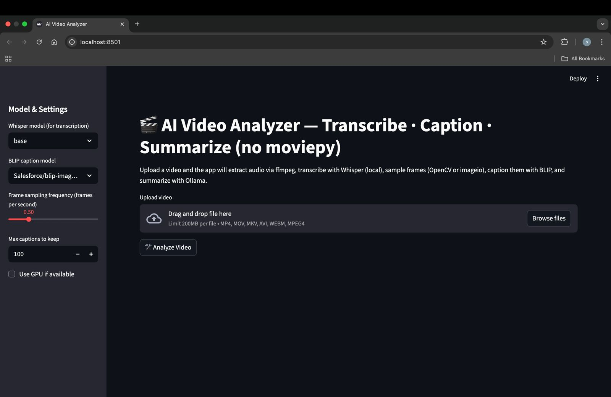
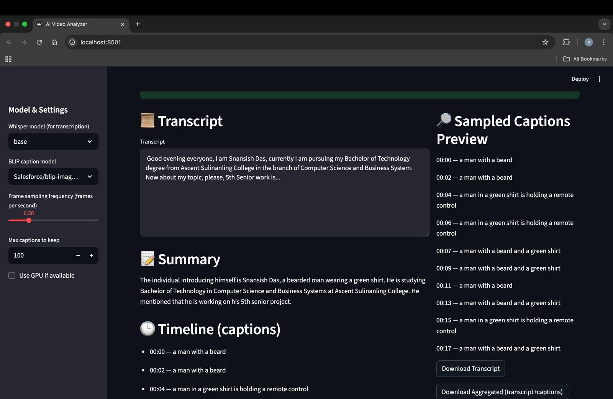
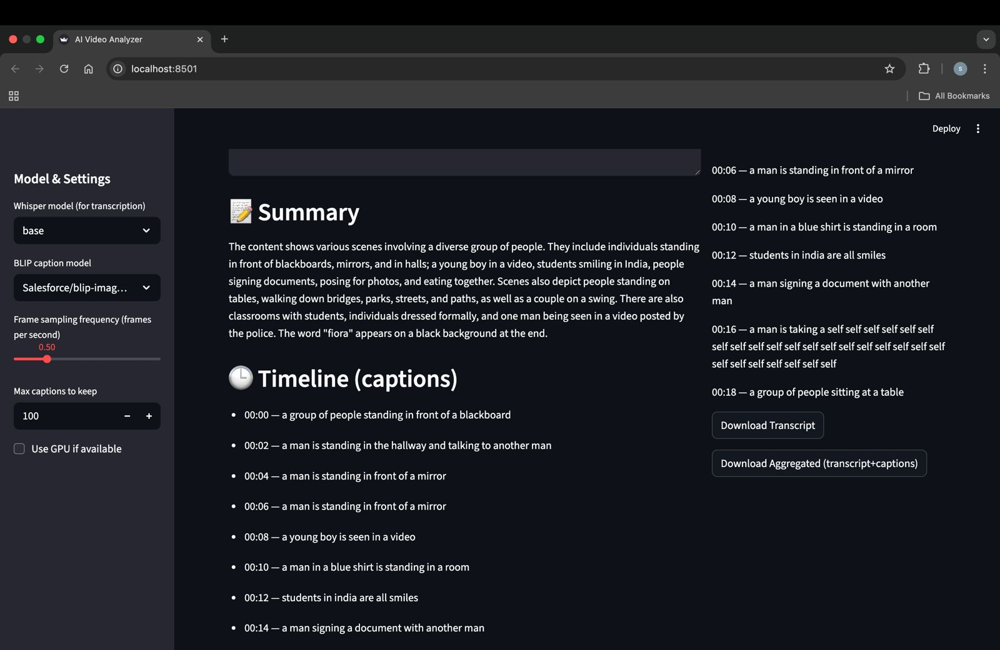
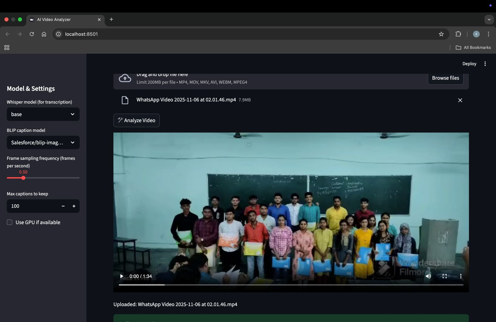

# 🎬 AI-Based Video Analyzer  
**Multimodal AI System for Video Understanding (Local & Privacy-First)**

An end-to-end **AI-powered video analysis application** that extracts **audio, visual, and semantic insights** from videos using **local AI models** — no paid APIs, no cloud dependency.

This project demonstrates **real-world multimodal AI engineering**, combining **Computer Vision, Speech Recognition, and Large Language Models** into a single production-style system.

---

## 🚀 What This Project Does

Given a video file, the system automatically:

- 🎧 Extracts audio using **FFmpeg**
- 🗣️ Transcribes speech with **Whisper (local)**
- 🖼️ Samples important video frames
- 🧠 Generates image captions using **BLIP**
- 🤖 Summarizes combined insights using **Ollama (LLM)**
- 🕒 Creates a timestamp-based video explanation

All processing happens **locally on the user’s machine**, ensuring **privacy, zero cost, and full control**.

---

## ✨ Key Highlights

- ✅ Multimodal AI (Audio + Vision + Language)
- ✅ 100% Local inference (no OpenAI / paid APIs)
- ✅ Whisper for speech-to-text
- ✅ BLIP for visual understanding
- ✅ Ollama (Mistral) for summarization
- ✅ FFmpeg-based audio extraction (no MoviePy)
- ✅ Modular, production-ready codebase
- ✅ Interactive Streamlit UI

---

## 🖼️ Application Screenshots

### 📤 Video Upload & Configuration


---

### 🗣️ Speech Transcription Output


---

### 🧠 AI-Generated Summary


---

### 🕒 Timeline-Based Caption Analysis


---

## 🏗️ Project Structure

```

ai-based-video-analyzer/
│
├── app.py                     # Streamlit application entry point
│
├── core/                      # Core AI pipeline logic
│   ├── audio.py               # Audio extraction layer
│   ├── transcription.py       # Whisper transcription
│   ├── video.py               # Video frame sampling
│   ├── captioning.py          # BLIP image captioning
│   └── summarizer.py          # LLM summarization (Ollama)
│
├── utils/                     # Utility helpers
│   ├── ffmpeg_utils.py        # FFmpeg helpers
│   └── time_utils.py          # Timestamp formatting
│
├── screenshots/               # UI screenshots
│
├── requirements.txt
└── README.md

````

---

## 🛠️ Tech Stack

### Core
- Python
- Streamlit
- FFmpeg

### AI / ML
- Whisper (Speech-to-Text)
- BLIP (Image Captioning)
- Ollama (Local LLM – Mistral)

### Libraries
- PyTorch
- HuggingFace Transformers
- OpenCV
- ImageIO
- LangChain (Ollama integration)

---

## ⚙️ Installation & Setup

### 1️⃣ Clone Repository

```bash
git clone https://github.com/Unknowncoder3/ai-based-video-analyzer.git
cd ai-based-video-analyzer
````

---

### 2️⃣ Create Virtual Environment

```bash
python -m venv venv
source venv/bin/activate   # macOS/Linux
venv\Scripts\activate      # Windows
```

---

### 3️⃣ Install Dependencies

```bash
pip install -r requirements.txt
```

---

### 4️⃣ Install FFmpeg

**macOS**

```bash
brew install ffmpeg
```

**Ubuntu**

```bash
sudo apt install ffmpeg
```

---

### 5️⃣ Install & Run Ollama

```bash
ollama pull mistral
ollama serve
```

---

### 6️⃣ Run the Application

```bash
streamlit run app.py
```

---

## 🧪 How to Use

1. Upload a video file (MP4 / MOV / MKV / AVI)
2. Click **Analyze Video**
3. View:

   * Speech transcription
   * AI-generated summary
   * Timestamped visual captions
4. Download or review insights

---

## 📈 Use Cases

* 🎥 Video content summarization
* 🧑‍🏫 Lecture & tutorial analysis
* 🎤 Interview review
* 🧠 Multimodal AI demos
* 📊 Media intelligence extraction

---

## 🔮 Future Enhancements

* Scene change detection
* Speaker diarization
* Emotion & sentiment analysis
* Batch video processing
* Timestamp-level summaries

---

## 👤 Author

**Snehasish Das**
Final Year CSBS Student | AI & Python Developer

* GitHub: [https://github.com/Unknowncoder3](https://github.com/Unknowncoder3)
* LinkedIn: [https://www.linkedin.com/in/snehasish-das-7a9803219](https://www.linkedin.com/in/snehasish-das-7a9803219)

---

## ⭐ Support

If you found this project helpful, please ⭐ **star the repository** — it really helps!

---

